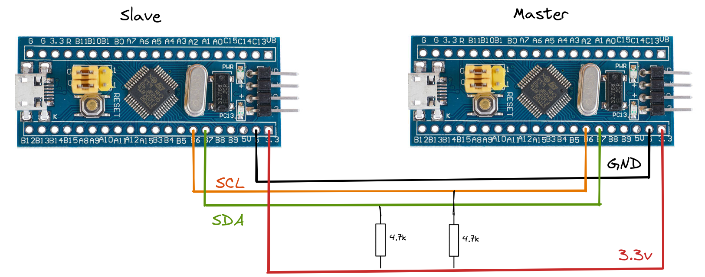

# TinyGo on STM32 Blue Pill

The repo contains a basic I2C usage samples. It focuses on providing an initial development environment for Tinygo with STM32 "Blue Pill". The development should be done in a container environment simplifying setup on different systems (*had issues on Fedora 37*).

## Development Container

Follow [Dev Containers tutorial](https://code.visualstudio.com/docs/devcontainers/tutorial) to get started with the development in containers. The repository contains [the development container configuration](./.devcontainer/devcontainer.json) for Tinygo development.

### Manual Approach

It is possible to use container only for building and flashing binaries to STM32 micro-controller. The commands below builds required container image and performs required actions.

```bash
# build dedicated container
make image

# access container shell
docker run --rm -it --entrypoint=/bin/bash \
    --privileged \
    -u root \
    -v /dev:/dev \
    -v "${PWD}:/${PWD##*/}" \
    -w "/${PWD##*/}" tinygo-stm32 make all

```

## Notes

### Device Drivers

The below command pulls [device drivers](https://tinygo.org/docs/reference/devices/) for Tinygo development environment.

```bash
go get tinygo.org/x/drivers
```

### Serial

```bash
#/dev/ttyUSB0 @ 115200bit/s
# monitor serial output
tinygo monitor -baudrate 115200 -port /dev/ttyUSB0

```

### I2C

- **ISR1**: It is the interrupt handling for interrupts generated by I2C events. It can be named as *I2C_EV_IRQHandling* API.
- **ISR2**: It is the interrupt handling for interrupts generated by I2C errors. It can be named as *I2C_ER_IRQHandling* API.

#### References

- [STM32 I2C Tutorial – HAL Code Examples Slave & Master – DMA Interrupt](https://deepbluembedded.com/stm32-i2c-tutorial-hal-examples-slave-dma/)
- [STM32 I2C Lecture 14: Implementation of I2C init API: Part 1](https://fastbitlab.com/implementation-of-i2c-init-api-part-1/)
- [https://fastbitlab.com/stm32-i2c-lecture-15-implementation-i2c-init-api-part-2/](https://fastbitlab.com/stm32-i2c-lecture-15-implementation-i2c-init-api-part-2/)
- [STM32 I2C Lecture 16: Implementation of I2C init API: Part 3](https://fastbitlab.com/implementation-of-i2c-init-api-part-3/)
- [I2C Using Interrupts Example in C](https://github.com/Laurenceb/Dactyl/blob/master/i2c_int.c)
- [How to create an I2C slave device using the STM32Cube Library](https://community.st.com/s/article/how-to-create-an-i2c-slave-device-using-the-stm32cube-library)
- [[STM32]: Making a custom i2c slave device using STM32F103](https://amitesh-singh.github.io/stm32/2018/01/07/making-i2c-slave-using-stm32f103.html)
- [Arduino_Core_STM32/libraries/Wire/src/Wire.h](https://github.com/stm32duino/Arduino_Core_STM32/blob/main/libraries/Wire/src/Wire.h)

### Byte Shifting

```go
package main

import "fmt"

func main() {
	flag := 0x1 // 0b00000001
	pos := 0x4  // 0b00000100
	fmt.Printf("%08b << %08b == %08b", flag, pos, (flag << pos))
}
// 00000001 << 00000100 == 00010000
```

## Connection Diagram




## STM32 "Blue Pill" Pin Diagram


## References

- [The Go Programming Language Specification](https://go.dev/ref/spec)
- [Golang Operators: Complete List](https://yourbasic.org/golang/operators/)
- [STM32F103 Reference Manual](https://www.st.com/resource/en/reference_manual/cd00171190-stm32f101xx-stm32f102xx-stm32f103xx-stm32f105xx-and-stm32f107xx-advanced-arm-based-32-bit-mcus-stmicroelectronics.pdf)
- [ST Micro STM32F103XX "Bluepill"](https://tinygo.org/docs/reference/microcontrollers/bluepill/)
- [Blue Pill](https://stm32-base.org/boards/STM32F103C8T6-Blue-Pill.html)
- [Blinking LED](https://tinygo.org/docs/tutorials/blinky/)
- [Container tinygo/tinygo](https://hub.docker.com/r/tinygo/tinygo)
- [Unable to start debug session with OpenOCD/Clion](https://stackoverflow.com/questions/71608471/unable-to-start-debug-session-with-openocd-clion)
- [STMicroelectronics/OpenOCD](https://github.com/STMicroelectronics/OpenOCD)
- [Developing inside a Container](https://code.visualstudio.com/docs/devcontainers/containers)
- [Using the I2C Bus](https://www.robot-electronics.co.uk/i2c-tutorial)
- [Go by Example](https://gobyexample.com/)
- [Go Slices: usage and internals](https://go.dev/blog/slices-intro)
- [Tutorial: Getting started with multi-module workspaces](https://go.dev/doc/tutorial/workspaces)

